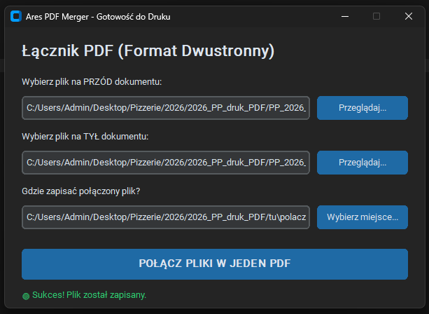

# PDF Merger - Łącznik Plików 🚀

Nowoczesna, lekka aplikacja desktopowa stworzona w Pythonie przy użyciu bibliotek **CustomTkinter** oraz **pypdf**. Narzędzie zostało zaprojektowane z myślą o maksymalnym uproszczeniu pracy biurowej i operacyjnej w gastronomii (szybkie łączenie jednostronicowych grafik menu, cenników oraz faktur w wielostronicowe gotowe dokumenty PDF do druku).

---

## 📸 Podgląd aplikacji



---

## ✨ Kluczowe funkcjonalności

* **Intuicyjny interfejs Multi-Select:** Wybór wielu plików jednocześnie z jednego katalogu systemowego za pomocą jednego kliknięcia (obsługa kombinacji `Ctrl` / `Shift` lub przeciągania myszką).
* **Inteligentne Sortowanie Naturalne (Natural Sort):** Zaawansowany algorytm dba o to, aby pliki tekstowe i liczbowe układały się w perfekcyjnej kolejności logicznej (np. `strona_1.pdf`, `strona_2.pdf`, `strona_10.pdf`).
* **Podgląd kolejki w czasie rzeczywistym:** Przejrzysty i czytelny boks tekstowy prezentuje ponumerowaną strukturę dokumentu wyjściowego przed ostatecznym scaleniem.
* **Automatyzacja ścieżki zapisu:** Użytkownik wskazuje jedynie folder docelowy, a system automatycznie buduje bezpieczną strukturę pliku wynikowego (`polaczony_dokument_do_druku.pdf`).
* **Odporność na błędy (Fail-Safe):** Pełne przechwytywanie wyjątków operacji dyskowych i uszkodzonych plików uniemożliwia zawieszenie się aplikacji.

---

## 🛠️ Architektura projektu

Projekt został przepisany z monolitu i podzielony na moduły zgodnie z zasadą separacji odpowiedzialności (*Separation of Concerns*):

* `src/core/` — Odpowiada za niskopoziomowe parsowanie, sortowanie i binarną manipulację strukturą plików PDF.
* `src/gui/` — Zarządza nowoczesnym interfejsem w ciemnym motywie graficznym (*Dark Theme*) z akcentami błękitu i karmazynu.
* `main.py` — Lekki punkt startowy aplikacji (*Entrypoint*).

---

## 🚀 Szybki start

### 1. Klonowanie repozytorium i przygotowanie folderu
```bash
git clone https://github.com/twoj-username/pdf-merger.git
cd pdf-merger